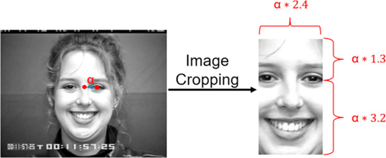

# Preprocessing Module
This module contains classes that are responsible for processing data and convert them to proper form for both training and inference modules.
This module contains four classes:
* [Frame Generator](#frame-generator)
* [Face Detector](#face-detector) 
* [Face Alignment](#face-alignment)
* [Spatial Normalizer](#spatial-normalizer)

## Frame Generator
This class process a list of videos. It extracts frames from each video with the help of two methods: `get_frames()` and `save_frames()`.

### get_frames
It extracts variable amount of frames from each video according to the `frame_per_second` which is a class file.
If it is used with passing `number_of_frames`, the number of extracted frames will be equal to `number_of_frames`.
The extracted frames are returned as a list.

### save_frames
This method uses get_frames to extract frames and save them in the path which is passed to it.
If the `output_path` is empty, the extracted frames will be save in default path which is: `prod_data/tests/test_images/generated_frames/` 
The number of extracted frame will be the same for all the videos if `number_of_frames` is passed.

## Face Detector 
This class detects human faces in the list of frames which is passed to it.
It stores the result in memory or to disk based on a flag from user input. For saving to disk, if `output_path` is empty the default 
path is used, i.e., `prod_data/tests/test_images/generated_frames/` 

## Face Alignment
This class is for aligning faces inside frames so as the eyes are in one line and both parallel to the x-axis. 
The result is returned as a list of frames or saved to the disk based on the `output_path` parameter that is passed into the method.

## Spatial Normalizer
This class runs a normalization algorithm based on the approach which is proposed in this [paper](https://www.sciencedirect.com/science/article/pii/S0031320316301753).
The below image shows an example of spatial normalization. As you see, it detects the face, align it and crop the image to focus on main 
features of the face.

The result is returned as a list of frames or saved to the disk based on the `output_path` parameter that is passed into the method.

This class needs `shape_predictor_68_face_landmarks.dat`, `face-detection-adas-0001.xml`, and `face-detection-adas-0001.bin` 
 to be in `models/` folder of the project. In case you cannot find these files, you can also download them here:
- `shape_predictor_68_face_landmarks.dat`: http://dlib.net/files/shape_predictor_68_face_landmarks.dat.bz2
- `face-detection-adas-0001.xml` and `face-detection-adas-0001.bin`: https://download.01.org/opencv/2020/openvinotoolkit/2020.4/open_model_zoo/models_bin/3/face-detection-adas-0001/FP32/

## Usage
Frame generator, face detector, face alignment, and spatial normalizer are invoked in training module or inference module by the configuration parameter in the configuration file.

